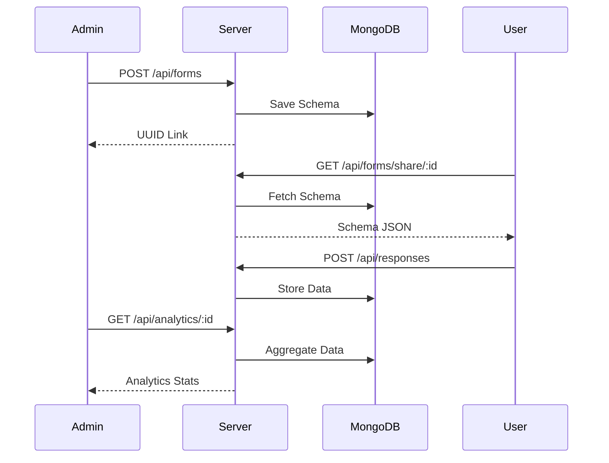

# FormFlow Analytics

Full-stack form builder application with real-time analytics. Design forms, collect responses, and visualize data trends automatically.

## Features

- **Dynamic Form Builder**: Add/remove text, number, and dropdown fields.
- **Unique Shareable Links**: UUID-based URLs for public form submission.
- **Live Analytics**: Visual breakdown of select field distributions and numeric averages.
- **Responsive Interface**: Mobile-friendly dashboard and renderer.
- **Performance Optimized**: Built-in caching and memoization.

## Architecture

### System Design
Monorepo with React frontend and Express/TypeScript backend.

### Data Flow


## Tech Stack

- **Frontend**: React 18, TypeScript, Tailwind CSS, Zustand, Recharts, Axios
- **Backend**: Node.js, Express.js, TypeScript
- **Database**: MongoDB (Mongoose)

## API Endpoints

- `GET /api/forms`: List all forms
- `POST /api/forms`: Create new form
- `GET /api/forms/share/:id`: Fetch public schema
- `POST /api/responses`: Submit response
- `GET /api/analytics/:id`: Fetch computed stats

## Environment Variables

### Server (`/server/.env`)
```env
PORT=5000
MONGODB_URI=your_mongodb_uri
ALLOWED_ORIGINS=http://localhost:3000
```

### Client (`/client/.env`)
```env
REACT_APP_API_URL=http://localhost:5000/api
```

## Setup Instructions

1. **Backend**:
   ```bash
   cd server
   npm install
   npm run seed
   npm run dev
   ```
2. **Frontend**:
   ```bash
   cd client
   npm install
   npm start
   ```

## Implementation Details

- **Rendering**: Dynamic component mapping in `PublicFormPage.tsx`.
- **Data Model**: Uses Mongoose `Map` for flexible answer storage.
- **Caching**: Local storage persistence in Zustand store.
- **Analytics**: Custom statistical engine in `analyticsHelper.ts`.
